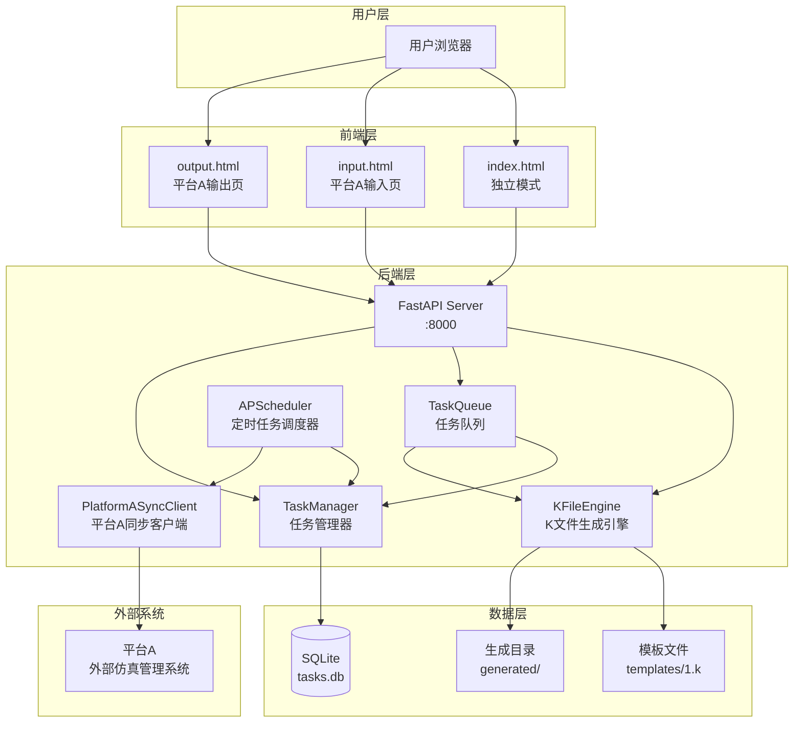
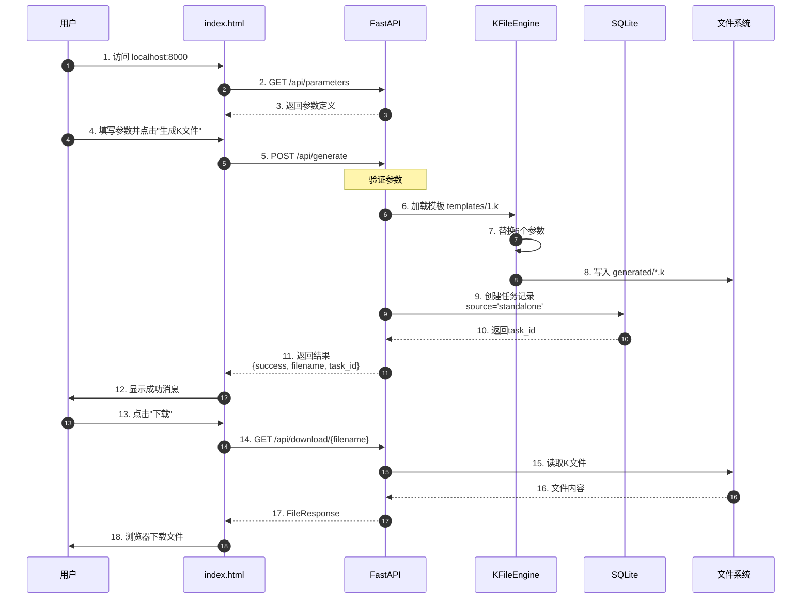
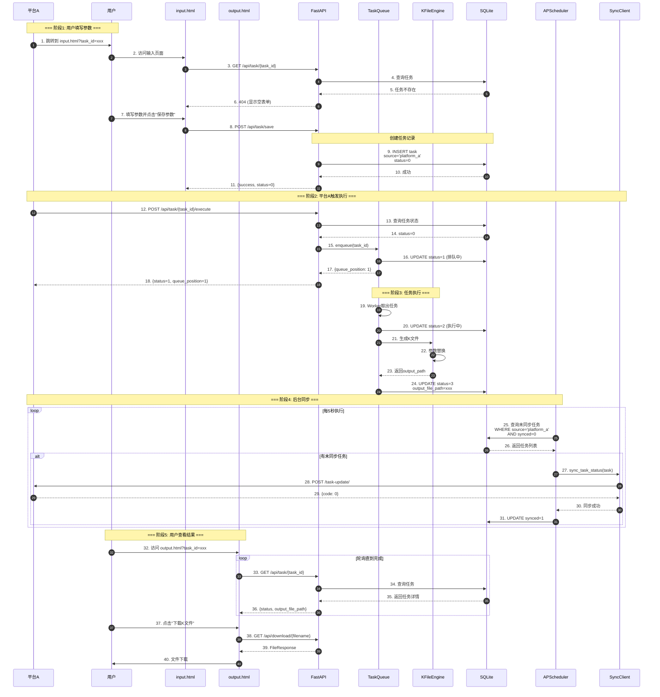
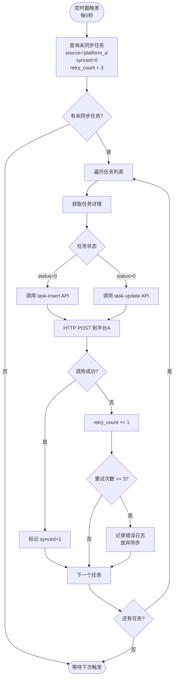
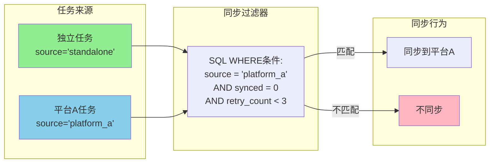
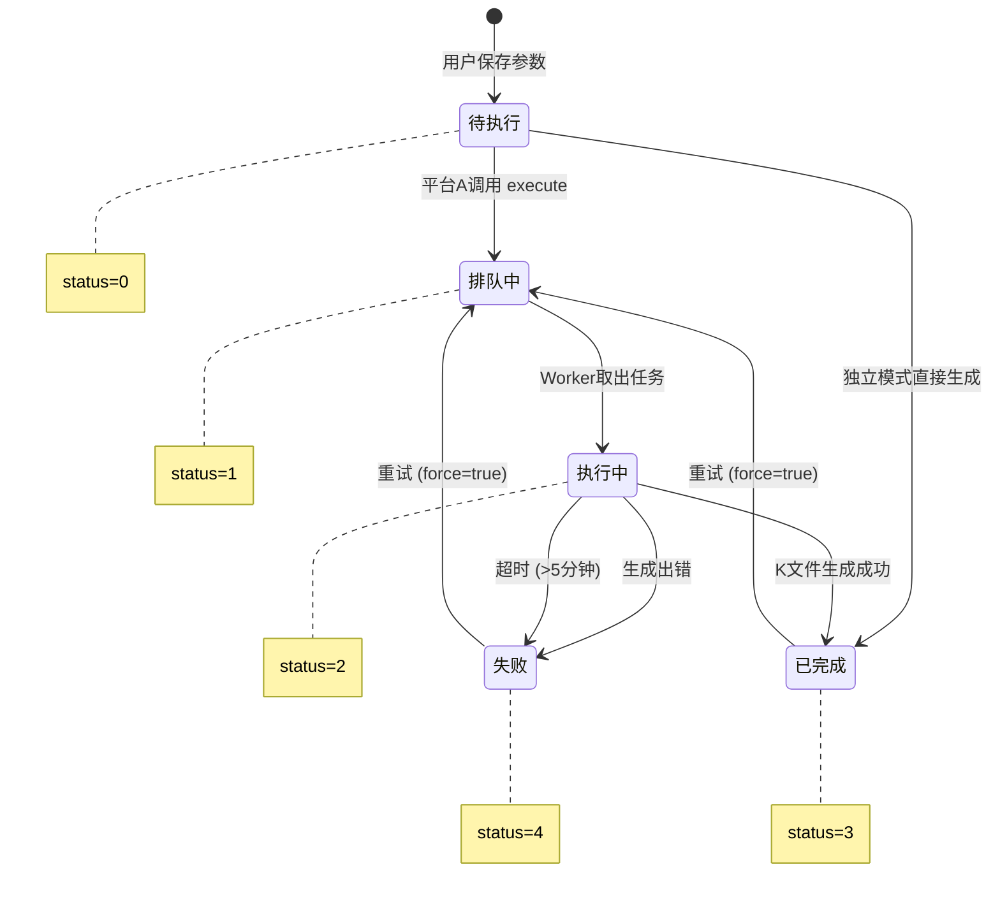
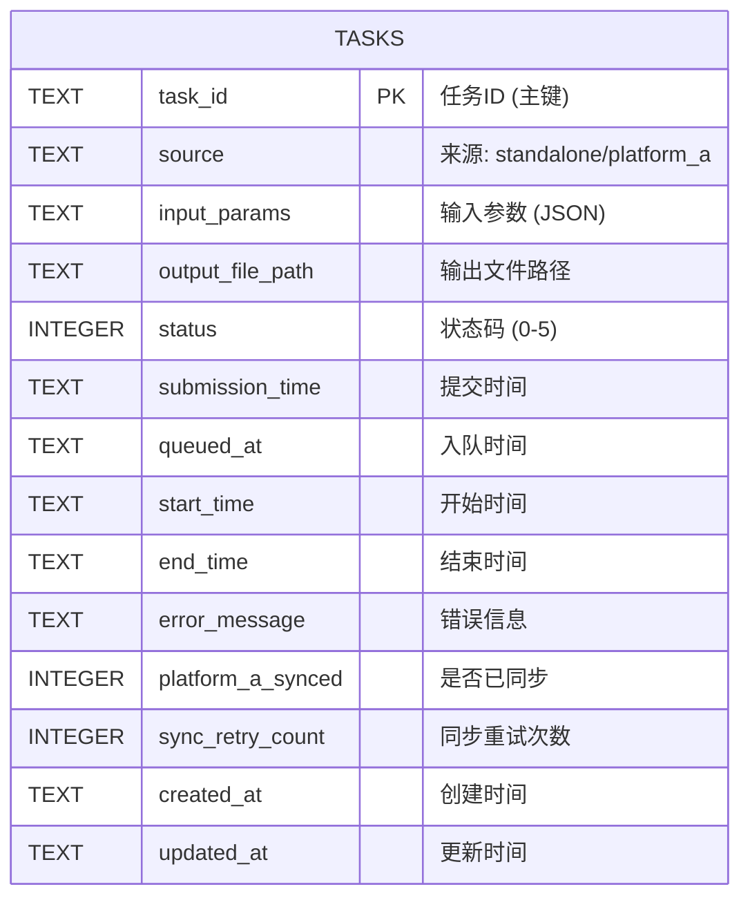
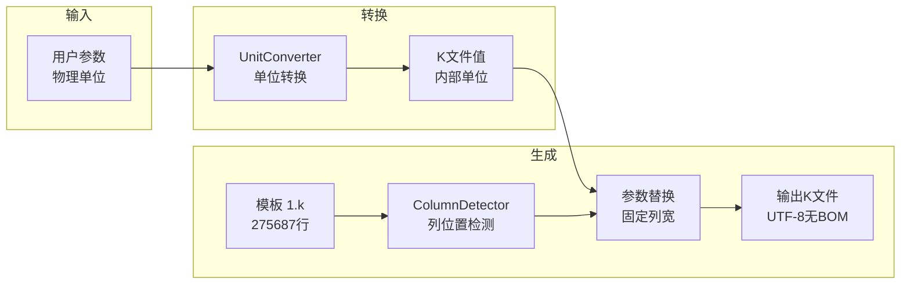

# LS-DYNA 子弹穿甲仿真系统 - 详细设计文档

**版本**: 3.0
**日期**: 2025-12-14
**状态**: 生产就绪

---

## 1. 系统概述

本系统是一个**LS-DYNA K文件参数化生成平台**，支持两种运行模式：
- **独立模式 (Standalone)**: 用户通过Web界面直接生成K文件
- **平台A集成模式 (Platform A)**: 与外部仿真管理平台集成，支持任务同步

### 1.1 技术栈

| 层级 | 技术选型 |
|------|----------|
| **前端** | HTML5 + CSS3 + JavaScript ES6 + Bootstrap 5 |
| **后端** | Python 3.11 + FastAPI + Pydantic |
| **数据库** | SQLite (单文件存储) |
| **定时任务** | APScheduler (BackgroundScheduler) |
| **热重载** | Uvicorn + watchfiles |

---

## 2. 日志信息解读

### 2.1 APScheduler 日志解析

```log
INFO:apscheduler.executors.default:Job "同步未同步任务到平台A
(trigger: interval[0:00:05], next run at: 2025-12-14 22:26:45 CST)"
executed successfully
```

**含义分解**：

| 组件 | 说明 |
|------|------|
| `apscheduler.executors.default` | APScheduler的默认执行器（线程池执行器） |
| `Job "同步未同步任务到平台A"` | 任务名称（在代码中定义） |
| `trigger: interval[0:00:05]` | 触发器类型：间隔触发器，每5秒执行一次 |
| `next run at: 2025-12-14 22:26:45 CST` | 下次执行时间 |
| `executed successfully` | 本次执行成功 |

**对应代码位置**: `backend/task_sync_scheduler.py:82-89`

```python
self.scheduler.add_job(
    func=self._sync_unsynced_tasks,  # 执行函数
    trigger=IntervalTrigger(seconds=5),  # 5秒间隔
    id='sync_tasks',
    name='同步未同步任务到平台A',  # 日志中显示的名称
    replace_existing=True
)
```

### 2.2 watchfiles 日志解析

```log
INFO:watchfiles.main:7 changes detected
```

**含义**：
- `watchfiles` 是 Uvicorn 的文件监控库
- 检测到7个文件变化（代码、配置等）
- 用于开发模式下的**热重载**（自动重启服务器）

**触发条件**：修改了 `backend/` 或 `frontend/` 目录下的任何文件

**注意**：生产环境应使用 `uvicorn app:app --host 0.0.0.0 --port 8000` 而非 `--reload`

---

## 3. 系统架构图

### 3.1 整体架构



### 3.2 模块职责说明

| 模块 | 文件 | 职责 |
|------|------|------|
| **FastAPI** | `app.py` | HTTP API接口，请求路由 |
| **KFileEngine** | `k_engine.py` | K文件参数替换和生成 |
| **TaskQueue** | `task_queue.py` | 任务排队和顺序执行 |
| **TaskManager** | `task_manager.py` | 任务CRUD和状态管理 |
| **Database** | `database.py` | SQLite数据访问层 |
| **Scheduler** | `task_sync_scheduler.py` | APScheduler定时任务 |
| **SyncClient** | `platform_sync.py` | 平台A HTTP通信 |

---

## 4. 前后端交互流程图

### 4.1 独立模式 (Standalone) 流程



### 4.2 平台A集成模式 流程



---

## 5. 定时同步机制详解

### 5.1 同步流程图



### 5.2 数据隔离机制



**关键代码** (`backend/database.py:302-325`):

```python
def get_unsynced_tasks(self, limit: int = 100) -> List[Dict[str, Any]]:
    """获取未同步任务 - 只返回platform_a来源的任务"""
    cursor.execute("""
        SELECT * FROM tasks
        WHERE platform_a_synced = 0
          AND source = 'platform_a'  -- 关键过滤条件
          AND sync_retry_count < 3
        ORDER BY updated_at ASC
        LIMIT ?
    """, (limit,))
```

---

## 6. 任务状态机

### 6.1 状态流转图



### 6.2 状态码定义

| 状态码 | 名称 | 英文 | 说明 | 同步行为 |
|--------|------|------|------|----------|
| 0 | 待执行 | pending | 参数已保存，等待触发 | 调用 task-insert |
| 1 | 排队中 | queued | 已加入队列，等待执行 | 调用 task-update |
| 2 | 执行中 | running | K文件正在生成 | 调用 task-update |
| 3 | 已完成 | completed | 成功生成K文件 | 调用 task-update |
| 4 | 失败 | failed | 生成失败 | 调用 task-update |
| 5 | 已中止 | aborted | 手动中止（预留） | 调用 task-update |

---

## 7. 数据库设计

### 7.1 ER图



### 7.2 索引设计

| 索引名 | 字段 | 用途 |
|--------|------|------|
| `idx_status` | `status` | 按状态查询任务 |
| `idx_platform_a_synced` | `platform_a_synced, status` | 查询未同步任务 |
| `idx_created_at` | `created_at DESC` | 按创建时间排序 |
| `idx_source` | `source` | 按来源过滤 |

---

## 8. API端点汇总

### 8.1 任务管理 API

| 方法 | 端点 | 说明 | 代码行 |
|------|------|------|--------|
| GET | `/api/task/{task_id}` | 查询任务详情 | app.py:557-587 |
| POST | `/api/task/save` | 保存任务参数 | app.py:592-680 |
| POST | `/api/task/{task_id}/execute` | 触发任务执行（幂等） | app.py:683-834 |
| GET | `/api/queue/status` | 查询队列状态 | app.py:837-855 |

### 8.2 K文件生成 API

| 方法 | 端点 | 说明 | 代码行 |
|------|------|------|--------|
| GET | `/api/parameters` | 获取参数定义 | app.py:295-315 |
| POST | `/api/validate` | 验证参数 | app.py:335-361 |
| POST | `/api/generate` | 生成K文件（独立模式） | app.py:364-473 |
| GET | `/api/files` | 列出已生成文件 | app.py:476-503 |
| GET | `/api/download/{filename}` | 下载K文件 | app.py:506-525 |

### 8.3 动画生成 API

| 方法 | 端点 | 说明 | 代码行 |
|------|------|------|--------|
| POST | `/api/animation/generate` | 创建动画任务 | app.py:972-1025 |
| GET | `/api/animation/status/{task_id}` | 查询动画状态 | app.py:1028-1063 |
| GET | `/api/animation/download/{task_id}` | 下载动画文件 | app.py:1101-1141 |

---

## 9. 关键代码路径

### 9.1 文件结构

```
Bullet_penetration_simulation/
├── backend/
│   ├── app.py                    # FastAPI主应用 (1200+行)
│   ├── database.py               # 数据库访问层 (400+行)
│   ├── task_manager.py           # 任务管理器 (250+行)
│   ├── task_queue.py             # 任务队列 (300+行)
│   ├── task_sync_scheduler.py    # APScheduler调度器 (200+行)
│   ├── platform_sync.py          # 平台A同步客户端 (220+行)
│   ├── k_engine.py               # K文件生成引擎 (350+行)
│   ├── parameter_config.py       # 参数配置定义 (150+行)
│   ├── column_detector.py        # 列位置检测器 (120+行)
│   ├── unit_converter.py         # 单位转换器 (100+行)
│   ├── animation_generator.py    # 动画生成器 (300+行)
│   ├── animation_config.py       # 动画配置 (80+行)
│   ├── config.json               # 系统配置
│   └── tasks.db                  # SQLite数据库
├── frontend/
│   ├── index.html                # 独立模式页面
│   ├── input.html                # 平台A输入页面
│   ├── output.html               # 平台A输出页面
│   ├── app.js                    # 前端JavaScript逻辑
│   └── style.css                 # 样式文件
├── templates/
│   └── 1.k                       # K文件模板 (275687行, 21MB)
├── generated/                    # 生成的K文件目录
└── docs/                         # 文档目录
```

### 9.2 核心数据流



---

## 10. 配置说明

### 10.1 config.json 完整配置

```json
{
  "platform_a": {
    "enabled": true,
    "mode": "hybrid",
    "base_url": "http://platform-a.example.com",
    "task_insert_endpoint": "/simulApi/web-app/task-insert/",
    "task_update_endpoint": "/simulApi/web-app/task-update/",
    "timeout": 10,
    "sync_interval": 5,
    "max_retry": 3
  },
  "lsprepost_executable": "E:\\ansys22r2\\ANSYS Inc\\v222\\ansys\\bin\\winx64\\lsprepost48\\lsprepost4.8_x64.exe",
  "animation_output_dir": "D:\\Simulations\\animations",
  "default_resolution": [1920, 1080],
  "default_format": "gif"
}
```

### 10.2 运行模式配置

| 模式 | enabled | mode | 说明 |
|------|---------|------|------|
| 完全禁用 | `false` | - | 调度器不启动，纯独立模式 |
| 独立模式 | `true` | `standalone` | 调度器启动但不同步 |
| 混合模式 | `true` | `hybrid` | 两种任务共存，平台A任务同步 |
| 纯平台A | `true` | `platform_a_only` | 只接受平台A任务 |

---

## 11. 性能指标

### 11.1 响应时间

| 操作 | 预期时间 | 说明 |
|------|----------|------|
| 参数验证 | < 50ms | 纯内存计算 |
| K文件生成 | 2-3秒 | 读写21MB文件 |
| 任务查询 | < 10ms | SQLite索引查询 |
| 同步请求 | < 1秒 | HTTP请求（含网络延迟） |

### 11.2 并发能力

| 组件 | 限制 | 原因 |
|------|------|------|
| FastAPI | 无限制 | 异步IO |
| TaskQueue | 1并发 | 顺序执行，避免文件冲突 |
| APScheduler | 1线程 | 单线程执行器 |
| SQLite | 有限 | WAL模式可提高并发 |

---

## 12. 已知问题与建议

### 12.1 当前限制

| 问题 | 影响 | 建议 |
|------|------|------|
| 线程超时是假超时 | 超时后线程仍在运行 | 改用subprocess |
| 同步重试次数硬编码 | 不够灵活 | 移到config.json |
| SQLite并发写入 | 高并发时锁等待 | 考虑PostgreSQL |

### 12.2 优化建议

1. **启用WAL模式**: 提高SQLite并发读写性能
2. **添加连接池**: 避免频繁创建数据库连接
3. **任务超时保护**: 使用subprocess替代线程
4. **监控仪表盘**: 添加Prometheus指标

---

## 13. 文档索引

| 文档 | 内容 |
|------|------|
| [api_contract.md](api_contract.md) | 平台A集成API契约 |
| [integration_guide.md](integration_guide.md) | 平台A联调指南 |
| [standalone_mode_guide.md](standalone_mode_guide.md) | 独立模式配置 |
| [unit_system.md](unit_system.md) | 单位转换系统 |
| [parameter_guide.md](parameter_guide.md) | 6个参数详细说明 |
| [visualization_solution.md](visualization_solution.md) | 动画生成技术方案 |
| [animation_user_guide.md](animation_user_guide.md) | 动画功能用户指南 |
| [platform_a_integration_design.md](platform_a_integration_design.md) | 平台A集成设计文档 |

---

**文档版本**: 3.0
**最后更新**: 2025-12-14
**维护者**: Claude Code
