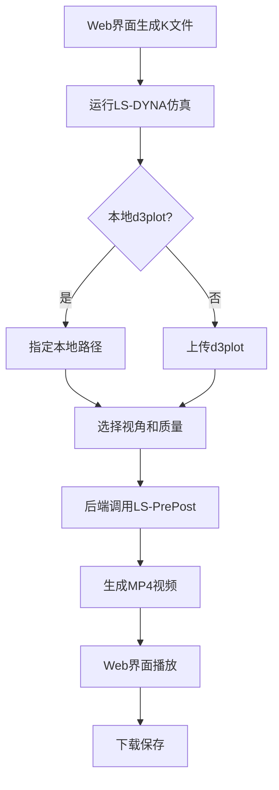

# d3plot可视化方案 - 技术实施文档

**版本**: 1.0
**日期**: 2025-11-07
**推荐方案**: LS-PrePost自动化 + Web视频播放

---

## 1. 方案对比分析

### 方案A：网页3D渲染（不推荐）

**技术栈**：
- 后端：Python + dynareadout/lsreader
- 转换：d3plot → JSON/glTF
- 前端：Three.js + WebGL

**优点**：
- 交互性强（旋转、缩放、剖面）
- 不依赖LS-PrePost许可证

**缺点**：
- 开发成本高（25天+ 基础版）
- 文件大（几百MB传输）
- 性能受限（大模型卡顿）
- 维护成本高（库更新、浏览器兼容性）
- 功能不如专业软件

**结论**：过度工程，性价比低

---

### 方案B：LS-PrePost自动化（强烈推荐）✅

**技术栈**：
- CFILE脚本（LS-PrePost命令语言）
- Python subprocess调用
- HTML5 video标签播放

**优点**：
- 开发成本低（3-5天完整方案）
- 专业级渲染质量
- 文件小（MP4压缩后几MB）
- 技术成熟稳定
- 用户已有许可证

**缺点**：
- 视角固定（可通过多视角缓解）
- 需要LS-PrePost安装

**结论**：最优方案，立即实施

---

## 2. 实施方案详解

### 2.1 阶段1：MVP版本（1天）

**目标**：提供CFILE脚本模板，用户手动运行

#### CFILE脚本模板

**文件**: `templates/cfile/basic_animation.cfile`

```cfile
$# LS-PrePost自动化脚本 - 基础动画导出
$# 使用方法: lsprepost c=basic_animation.cfile

$# 1. 打开d3plot文件
*OPEN d3plot

$# 2. 设置显示变量（有效应力）
*FRINGE 1 1
$# fringe_component=1 (von Mises stress)
$# 1=effective_stress

$# 3. 设置视角
*VIEW ISOMETRIC
$# 等轴测视角（标准查看角度）

$# 4. 调整缩放
*SCALE AUTO
$# 自动调整缩放以显示完整模型

$# 5. 设置配色方案
*PALETTE RAINBOW
$# 彩虹色谱（蓝-绿-黄-红）

$# 6. 导出动画
*OUTPUT MOVIE animation.mp4 1920 1080 30
$# 格式: mp4
$# 分辨率: 1920x1080 (Full HD)
$# 帧率: 30fps

$# 7. 播放动画并录制
*ANIMATE

$# 8. 退出
*QUIT
```

**多视角版本**: `templates/cfile/multi_view_animation.cfile`

```cfile
$# 多视角动画导出

*OPEN d3plot
*FRINGE 1 1

$# 视角1: 正面
*VIEW FRONT
*OUTPUT MOVIE animation_front.mp4 1280 720 30
*ANIMATE

$# 视角2: 侧面
*VIEW SIDE
*OUTPUT MOVIE animation_side.mp4 1280 720 30
*ANIMATE

$# 视角3: 等轴测
*VIEW ISOMETRIC
*OUTPUT MOVIE animation_iso.mp4 1280 720 30
*ANIMATE

$# 视角4: 剖面（Z方向中间位置）
*SECTION Z 0.0
*OUTPUT MOVIE animation_section.mp4 1280 720 30
*ANIMATE

*QUIT
```

**应力云图版本**: `templates/cfile/stress_contour.cfile`

```cfile
$# 应力云图动画

*OPEN d3plot
*FRINGE 1 1

$# 设置应力范围（自动或手动）
*RANGE AUTO
$# 或手动设置: *RANGE 0.0 1.5e9

$# 隐藏未变形网格
*MESH OFF

$# 平滑着色
*SMOOTH ON

$# 显示颜色条
*LEGEND ON

$# 导出
*VIEW ISOMETRIC
*OUTPUT MOVIE stress_contour.mp4 1920 1080 30
*ANIMATE

*QUIT
```

#### 用户使用说明文档

**文件**: `docs/how_to_export_animation.md`

```markdown
# 如何导出仿真动画

## 步骤1: 运行仿真

1. 在Web界面生成K文件
2. 使用LS-DYNA运行仿真
3. 确保生成了d3plot文件

## 步骤2: 导出动画

**Windows系统**:
```cmd
cd /path/to/d3plot
lsprepost c=basic_animation.cfile
```

**Linux系统**:
```bash
cd /path/to/d3plot
xvfb-run lsprepost -nographics -c basic_animation.cfile
```

## 步骤3: 查看和上传

1. 找到生成的 `animation.mp4` 文件
2. 在Web界面的"历史记录"页面
3. 点击"上传动画"按钮
4. 选择视频文件上传

## 常见问题

**Q: 视频文件在哪里？**
A: 与d3plot文件同目录，文件名为 `animation.mp4`

**Q: 如何修改视频质量？**
A: 编辑CFILE文件，修改分辨率和帧率：
```
*OUTPUT MOVIE animation.mp4 3840 2160 60
# 4K分辨率，60fps
```

**Q: 如何只导出部分时间段？**
A: 在CFILE中添加：
```
*TIME_RANGE 0.0 20.0
# 只导出0-20微秒
```
```

---

### 2.2 阶段2：后端自动化（+3天）

**目标**：后端自动调用LS-PrePost，无需用户手动操作

#### 后端实现

**文件**: `backend/animation_generator.py`

```python
#!/usr/bin/env python
# -*- coding: utf-8 -*-
"""
LS-PrePost动画生成器
自动调用LS-PrePost生成仿真动画
"""

import os
import subprocess
import shutil
from pathlib import Path
from typing import Optional, List, Dict
import tempfile


class AnimationGenerator:
    """LS-PrePost动画生成器"""

    def __init__(self, lsprepost_path: str = "lsprepost"):
        """
        初始化生成器

        Args:
            lsprepost_path: LS-PrePost可执行文件路径
                           Windows: "C:/Program Files/LSTC/LS-PrePost/lsprepost.exe"
                           Linux: "lsprepost"
        """
        self.lsprepost_path = lsprepost_path
        self.template_dir = Path(__file__).parent.parent / "templates" / "cfile"

    def generate_animation(
        self,
        d3plot_path: str,
        output_path: str,
        view: str = "isometric",
        resolution: tuple = (1920, 1080),
        fps: int = 30,
        fringe_var: str = "stress"
    ) -> Dict[str, any]:
        """
        生成动画

        Args:
            d3plot_path: d3plot文件路径
            output_path: 输出视频路径
            view: 视角 (front/side/isometric/top)
            resolution: 分辨率 (width, height)
            fps: 帧率
            fringe_var: 显示变量 (stress/strain/displacement)

        Returns:
            {
                "success": bool,
                "output_path": str,
                "file_size": int,
                "message": str
            }
        """
        # 验证d3plot文件存在
        if not os.path.exists(d3plot_path):
            return {
                "success": False,
                "message": f"d3plot文件不存在: {d3plot_path}"
            }

        # 生成CFILE脚本
        cfile_content = self._generate_cfile(
            d3plot_path=d3plot_path,
            output_path=output_path,
            view=view,
            resolution=resolution,
            fps=fps,
            fringe_var=fringe_var
        )

        # 创建临时CFILE文件
        with tempfile.NamedTemporaryFile(
            mode='w',
            suffix='.cfile',
            delete=False,
            encoding='utf-8'
        ) as f:
            f.write(cfile_content)
            cfile_path = f.name

        try:
            # 调用LS-PrePost
            result = self._run_lsprepost(cfile_path)

            if result["success"]:
                # 检查输出文件
                if os.path.exists(output_path):
                    file_size = os.path.getsize(output_path)
                    return {
                        "success": True,
                        "output_path": output_path,
                        "file_size": file_size,
                        "message": f"动画生成成功: {output_path}"
                    }
                else:
                    return {
                        "success": False,
                        "message": "LS-PrePost执行成功但未找到输出文件"
                    }
            else:
                return result

        finally:
            # 清理临时文件
            if os.path.exists(cfile_path):
                os.remove(cfile_path)

    def _generate_cfile(
        self,
        d3plot_path: str,
        output_path: str,
        view: str,
        resolution: tuple,
        fps: int,
        fringe_var: str
    ) -> str:
        """生成CFILE脚本内容"""

        # 映射变量名到FRINGE代码
        fringe_map = {
            "stress": "1 1",  # von Mises stress
            "strain": "2 1",  # effective strain
            "displacement": "6 1"  # total displacement
        }
        fringe_code = fringe_map.get(fringe_var, "1 1")

        # 映射视角
        view_map = {
            "front": "FRONT",
            "side": "SIDE",
            "top": "TOP",
            "isometric": "ISOMETRIC"
        }
        view_cmd = view_map.get(view.lower(), "ISOMETRIC")

        width, height = resolution

        cfile = f"""$# Auto-generated CFILE by AnimationGenerator
$# Generated: {__import__('datetime').datetime.now()}

*OPEN {d3plot_path}
*FRINGE {fringe_code}
*VIEW {view_cmd}
*SCALE AUTO
*PALETTE RAINBOW
*MESH OFF
*SMOOTH ON
*LEGEND ON
*OUTPUT MOVIE {output_path} {width} {height} {fps}
*ANIMATE
*QUIT
"""
        return cfile

    def _run_lsprepost(self, cfile_path: str) -> Dict[str, any]:
        """运行LS-PrePost"""

        try:
            # 检查操作系统
            is_linux = os.name != 'nt'

            if is_linux:
                # Linux需要Xvfb虚拟framebuffer
                cmd = [
                    'xvfb-run',
                    '--auto-servernum',
                    '--server-args', '-screen 0 1920x1080x24',
                    self.lsprepost_path,
                    '-nographics',
                    f'-c={cfile_path}'
                ]
            else:
                # Windows直接调用
                cmd = [
                    self.lsprepost_path,
                    f'c={cfile_path}'
                ]

            # 执行命令
            result = subprocess.run(
                cmd,
                capture_output=True,
                text=True,
                timeout=600  # 10分钟超时
            )

            if result.returncode == 0:
                return {
                    "success": True,
                    "message": "LS-PrePost执行成功"
                }
            else:
                return {
                    "success": False,
                    "message": f"LS-PrePost执行失败: {result.stderr}"
                }

        except subprocess.TimeoutExpired:
            return {
                "success": False,
                "message": "LS-PrePost执行超时（>10分钟）"
            }
        except FileNotFoundError:
            return {
                "success": False,
                "message": f"未找到LS-PrePost: {self.lsprepost_path}"
            }
        except Exception as e:
            return {
                "success": False,
                "message": f"执行异常: {str(e)}"
            }

    def generate_multi_view(
        self,
        d3plot_path: str,
        output_dir: str,
        views: List[str] = None
    ) -> Dict[str, any]:
        """
        生成多视角动画

        Args:
            d3plot_path: d3plot文件路径
            output_dir: 输出目录
            views: 视角列表，默认 ['front', 'side', 'isometric']

        Returns:
            {
                "success": bool,
                "videos": List[str],
                "message": str
            }
        """
        if views is None:
            views = ['front', 'side', 'isometric']

        os.makedirs(output_dir, exist_ok=True)

        results = []
        for view in views:
            output_path = os.path.join(output_dir, f'animation_{view}.mp4')
            result = self.generate_animation(
                d3plot_path=d3plot_path,
                output_path=output_path,
                view=view
            )
            results.append(result)

        success_count = sum(1 for r in results if r["success"])

        return {
            "success": success_count > 0,
            "videos": [r["output_path"] for r in results if r["success"]],
            "message": f"成功生成 {success_count}/{len(views)} 个视角"
        }


# 使用示例
if __name__ == "__main__":
    generator = AnimationGenerator()

    # 单视角
    result = generator.generate_animation(
        d3plot_path="./d3plot",
        output_path="./animation.mp4"
    )
    print(result)

    # 多视角
    result = generator.generate_multi_view(
        d3plot_path="./d3plot",
        output_dir="./animations"
    )
    print(result)
```

#### FastAPI接口

**文件**: `backend/app.py` (添加到现有代码)

```python
from animation_generator import AnimationGenerator

# 初始化动画生成器
animation_gen = AnimationGenerator(
    lsprepost_path=os.getenv("LSPREPOST_PATH", "lsprepost")
)


class AnimationRequest(BaseModel):
    """动画生成请求"""
    d3plot_path: str = Field(..., description="d3plot文件路径")
    view: str = Field("isometric", description="视角")
    resolution: str = Field("1080p", description="分辨率")
    fps: int = Field(30, description="帧率")
    fringe_var: str = Field("stress", description="显示变量")


@app.post("/api/animation/generate")
async def generate_animation(request: AnimationRequest):
    """
    生成仿真动画

    使用LS-PrePost自动生成d3plot的动画视频
    """
    try:
        # 解析分辨率
        resolution_map = {
            "720p": (1280, 720),
            "1080p": (1920, 1080),
            "1440p": (2560, 1440),
            "4k": (3840, 2160)
        }
        resolution = resolution_map.get(request.resolution, (1920, 1080))

        # 生成输出路径
        timestamp = datetime.now().strftime("%Y%m%d_%H%M%S")
        output_filename = f"animation_{timestamp}_{request.view}.mp4"
        output_path = GENERATED_DIR / "animations" / output_filename

        # 创建输出目录
        output_path.parent.mkdir(parents=True, exist_ok=True)

        # 生成动画
        result = animation_gen.generate_animation(
            d3plot_path=request.d3plot_path,
            output_path=str(output_path),
            view=request.view,
            resolution=resolution,
            fps=request.fps,
            fringe_var=request.fringe_var
        )

        if result["success"]:
            return {
                "success": True,
                "video_url": f"/api/animation/video/{output_filename}",
                "file_size": result["file_size"],
                "message": result["message"]
            }
        else:
            raise HTTPException(status_code=500, detail=result["message"])

    except Exception as e:
        raise HTTPException(status_code=500, detail=str(e))


@app.post("/api/animation/generate-multi-view")
async def generate_multi_view_animation(d3plot_path: str):
    """生成多视角动画"""
    try:
        timestamp = datetime.now().strftime("%Y%m%d_%H%M%S")
        output_dir = GENERATED_DIR / "animations" / timestamp

        result = animation_gen.generate_multi_view(
            d3plot_path=d3plot_path,
            output_dir=str(output_dir)
        )

        if result["success"]:
            video_urls = [
                f"/api/animation/video/{Path(v).name}"
                for v in result["videos"]
            ]
            return {
                "success": True,
                "videos": video_urls,
                "message": result["message"]
            }
        else:
            raise HTTPException(status_code=500, detail=result["message"])

    except Exception as e:
        raise HTTPException(status_code=500, detail=str(e))


@app.get("/api/animation/video/{filename}")
async def get_animation_video(filename: str):
    """获取动画视频"""
    video_path = GENERATED_DIR / "animations" / filename

    if not video_path.exists():
        raise HTTPException(status_code=404, detail="视频不存在")

    return FileResponse(
        video_path,
        media_type="video/mp4",
        filename=filename
    )
```

#### 前端实现

**文件**: `frontend/animation.html` (新增页面)

```html
<!DOCTYPE html>
<html lang="zh-CN">
<head>
    <meta charset="UTF-8">
    <title>仿真动画查看器</title>
    <link href="https://cdn.jsdelivr.net/npm/bootstrap@5.3.0/dist/css/bootstrap.min.css" rel="stylesheet">
</head>
<body>
    <div class="container mt-5">
        <h1>仿真动画生成</h1>

        <div class="card mt-4">
            <div class="card-header">
                <h5>生成动画</h5>
            </div>
            <div class="card-body">
                <form id="animationForm">
                    <div class="mb-3">
                        <label class="form-label">d3plot文件路径</label>
                        <input type="text" class="form-control" id="d3plotPath"
                               placeholder="例: C:/simulations/d3plot">
                    </div>

                    <div class="row">
                        <div class="col-md-4">
                            <label class="form-label">视角</label>
                            <select class="form-select" id="view">
                                <option value="isometric">等轴测</option>
                                <option value="front">正面</option>
                                <option value="side">侧面</option>
                                <option value="top">顶部</option>
                            </select>
                        </div>

                        <div class="col-md-4">
                            <label class="form-label">分辨率</label>
                            <select class="form-select" id="resolution">
                                <option value="720p">720p (HD)</option>
                                <option value="1080p" selected>1080p (Full HD)</option>
                                <option value="1440p">1440p (2K)</option>
                                <option value="4k">4K (Ultra HD)</option>
                            </select>
                        </div>

                        <div class="col-md-4">
                            <label class="form-label">显示变量</label>
                            <select class="form-select" id="fringeVar">
                                <option value="stress">有效应力</option>
                                <option value="strain">有效应变</option>
                                <option value="displacement">位移</option>
                            </select>
                        </div>
                    </div>

                    <div class="mt-3">
                        <button type="button" class="btn btn-primary" onclick="generateAnimation()">
                            生成单视角动画
                        </button>
                        <button type="button" class="btn btn-success" onclick="generateMultiView()">
                            生成多视角动画
                        </button>
                    </div>
                </form>

                <div id="progressDiv" class="mt-3 d-none">
                    <div class="progress">
                        <div class="progress-bar progress-bar-striped progress-bar-animated"
                             style="width: 100%">
                            正在生成动画，请稍候...
                        </div>
                    </div>
                </div>
            </div>
        </div>

        <div id="videoDiv" class="card mt-4 d-none">
            <div class="card-header">
                <h5>动画预览</h5>
            </div>
            <div class="card-body">
                <video id="videoPlayer" controls width="100%" style="max-width: 1920px;">
                    您的浏览器不支持视频播放
                </video>

                <div class="mt-3">
                    <button class="btn btn-sm btn-outline-primary" onclick="downloadVideo()">
                        <i class="bi bi-download"></i> 下载视频
                    </button>
                    <span id="fileSize" class="text-muted ms-3"></span>
                </div>
            </div>
        </div>

        <div id="multiViewDiv" class="card mt-4 d-none">
            <div class="card-header">
                <h5>多视角预览</h5>
            </div>
            <div class="card-body">
                <ul class="nav nav-tabs" id="viewTabs"></ul>
                <div class="tab-content mt-3" id="viewContent"></div>
            </div>
        </div>
    </div>

    <script>
        let currentVideoUrl = '';

        async function generateAnimation() {
            const d3plotPath = document.getElementById('d3plotPath').value;
            const view = document.getElementById('view').value;
            const resolution = document.getElementById('resolution').value;
            const fringeVar = document.getElementById('fringeVar').value;

            if (!d3plotPath) {
                alert('请输入d3plot文件路径');
                return;
            }

            // 显示进度条
            document.getElementById('progressDiv').classList.remove('d-none');
            document.getElementById('videoDiv').classList.add('d-none');

            try {
                const response = await fetch('/api/animation/generate', {
                    method: 'POST',
                    headers: {'Content-Type': 'application/json'},
                    body: JSON.stringify({
                        d3plot_path: d3plotPath,
                        view: view,
                        resolution: resolution,
                        fringe_var: fringeVar
                    })
                });

                const result = await response.json();

                if (result.success) {
                    // 显示视频
                    currentVideoUrl = result.video_url;
                    document.getElementById('videoPlayer').src = currentVideoUrl;
                    document.getElementById('fileSize').textContent =
                        `文件大小: ${(result.file_size / 1024 / 1024).toFixed(2)} MB`;

                    document.getElementById('videoDiv').classList.remove('d-none');
                    document.getElementById('progressDiv').classList.add('d-none');

                    alert('动画生成成功！');
                } else {
                    alert('生成失败: ' + (result.message || '未知错误'));
                    document.getElementById('progressDiv').classList.add('d-none');
                }
            } catch (error) {
                alert('请求失败: ' + error.message);
                document.getElementById('progressDiv').classList.add('d-none');
            }
        }

        async function generateMultiView() {
            const d3plotPath = document.getElementById('d3plotPath').value;

            if (!d3plotPath) {
                alert('请输入d3plot文件路径');
                return;
            }

            document.getElementById('progressDiv').classList.remove('d-none');
            document.getElementById('multiViewDiv').classList.add('d-none');

            try {
                const response = await fetch(
                    `/api/animation/generate-multi-view?d3plot_path=${encodeURIComponent(d3plotPath)}`,
                    {method: 'POST'}
                );

                const result = await response.json();

                if (result.success) {
                    // 创建多视角标签页
                    const tabs = document.getElementById('viewTabs');
                    const content = document.getElementById('viewContent');
                    tabs.innerHTML = '';
                    content.innerHTML = '';

                    result.videos.forEach((videoUrl, index) => {
                        const viewName = videoUrl.split('_').pop().replace('.mp4', '');
                        const active = index === 0 ? 'active' : '';

                        // 创建标签
                        tabs.innerHTML += `
                            <li class="nav-item">
                                <a class="nav-link ${active}" data-bs-toggle="tab"
                                   href="#view${index}">${viewName}</a>
                            </li>
                        `;

                        // 创建内容
                        content.innerHTML += `
                            <div class="tab-pane fade ${active} show" id="view${index}">
                                <video controls width="100%" style="max-width: 1920px;">
                                    <source src="${videoUrl}" type="video/mp4">
                                </video>
                            </div>
                        `;
                    });

                    document.getElementById('multiViewDiv').classList.remove('d-none');
                    document.getElementById('progressDiv').classList.add('d-none');

                    alert(`成功生成 ${result.videos.length} 个视角的动画！`);
                } else {
                    alert('生成失败: ' + result.message);
                    document.getElementById('progressDiv').classList.add('d-none');
                }
            } catch (error) {
                alert('请求失败: ' + error.message);
                document.getElementById('progressDiv').classList.add('d-none');
            }
        }

        function downloadVideo() {
            if (currentVideoUrl) {
                window.location.href = currentVideoUrl;
            }
        }
    </script>

    <script src="https://cdn.jsdelivr.net/npm/bootstrap@5.3.0/dist/js/bootstrap.bundle.min.js"></script>
</body>
</html>
```

---

### 2.3 阶段3：轻量级WebGL渲染（可选，远期）

**仅用于小模型**（节点数 < 10万）

**技术栈**：
- dynareadout (d3plot解析)
- Three.js (3D渲染)
- 限制文件大小 < 100MB

**实施时机**：
- 用户强烈要求交互功能时
- 经费充足，有2-3个月开发时间

---

## 3. 生产环境部署

### 3.1 环境要求

```yaml
系统:
  - Windows 10/11 或 Linux (Ubuntu 20.04+)

软件:
  - LS-DYNA (任意版本)
  - LS-PrePost 4.8+ (随LS-DYNA提供)
  - Python 3.8+
  - FFmpeg (用于视频处理)

Linux额外要求:
  - Xvfb (虚拟framebuffer)
  - 安装: sudo apt-get install xvfb
```

### 3.2 配置文件

**文件**: `backend/config.py`

```python
import os

class Config:
    # LS-PrePost路径配置
    LSPREPOST_PATH = os.getenv(
        "LSPREPOST_PATH",
        "C:/Program Files/LSTC/LS-PrePost/lsprepost.exe"  # Windows默认
        # "/usr/local/bin/lsprepost"  # Linux默认
    )

    # 动画输出目录
    ANIMATION_DIR = os.path.join(os.path.dirname(__file__), "../generated/animations")

    # 视频质量配置
    DEFAULT_RESOLUTION = "1080p"
    DEFAULT_FPS = 30
    MAX_VIDEO_SIZE_MB = 500  # 最大视频文件大小限制

    # 超时设置
    LSPREPOST_TIMEOUT = 600  # 10分钟
```

### 3.3 Docker部署（Linux）

**文件**: `docker/Dockerfile.animation`

```dockerfile
FROM ubuntu:20.04

# 安装依赖
RUN apt-get update && apt-get install -y \
    python3 \
    python3-pip \
    xvfb \
    ffmpeg \
    && rm -rf /var/lib/apt/lists/*

# 复制LS-PrePost (需要许可证)
COPY lsprepost /usr/local/bin/
RUN chmod +x /usr/local/bin/lsprepost

# 安装Python依赖
COPY requirements.txt /app/
RUN pip3 install -r /app/requirements.txt

# 复制应用代码
COPY backend /app/backend
WORKDIR /app

CMD ["python3", "backend/app.py"]
```

---

## 4. 性能优化

### 4.1 视频压缩

LS-PrePost默认生成的MP4使用H.264编码，已经有良好的压缩比。

**进一步优化**（可选）:

```python
import subprocess

def compress_video(input_path: str, output_path: str, crf: int = 23):
    """
    使用FFmpeg进一步压缩视频

    Args:
        crf: 质量参数 (18-28, 越小质量越高)
    """
    cmd = [
        'ffmpeg',
        '-i', input_path,
        '-c:v', 'libx264',
        '-crf', str(crf),
        '-preset', 'medium',
        '-c:a', 'copy',
        output_path
    ]
    subprocess.run(cmd, check=True)
```

### 4.2 并行生成

多视角动画可并行生成：

```python
from concurrent.futures import ThreadPoolExecutor

def generate_multi_view_parallel(d3plot_path, output_dir, views):
    with ThreadPoolExecutor(max_workers=3) as executor:
        futures = []
        for view in views:
            output_path = f"{output_dir}/animation_{view}.mp4"
            future = executor.submit(
                generator.generate_animation,
                d3plot_path, output_path, view
            )
            futures.append(future)

        results = [f.result() for f in futures]
    return results
```

---

## 5. 用户工作流示例

### 完整流程



### 用户操作步骤

1. **生成K文件**（已有功能）
2. **运行仿真**（用户在本地）
3. **生成动画**（新功能）：
   - 方式A：提供d3plot本地路径 ← 推荐（无需上传GB级文件）
   - 方式B：上传d3plot到服务器
4. **选择配置**：
   - 视角：正面/侧面/等轴测
   - 分辨率：720p/1080p/4K
   - 显示变量：应力/应变/位移
5. **点击生成**
6. **等待1-3分钟**（取决于模型大小）
7. **在线预览**（HTML5 video播放器）
8. **下载视频**（MP4格式）

---

## 6. 成本收益分析

### 开发成本

| 阶段 | 工作量 | 交付时间 |
|-----|--------|---------|
| 阶段1 (MVP) | 1天 | 立即 |
| 阶段2 (自动化) | +3天 | 1周内 |
| 阶段3 (WebGL) | +25天 | 2个月 |

### 运营成本

- **存储成本**：每个视频 5-50MB，100个视频 ≈ 5GB
- **计算成本**：生成1个视频 1-3分钟CPU时间
- **许可成本**：用户已有LS-PrePost许可证

### 用户价值

- ✅ 快速预览仿真结果（无需打开LS-PrePost）
- ✅ 参数-结果关联（每个K文件对应动画）
- ✅ 对比分析（并排播放多个动画）
- ✅ 远程协作（分享视频链接）
- ✅ 报告制作（直接插入MP4到PPT/Word）

---

## 7. 风险与缓解

### 风险1：LS-PrePost许可证问题

**风险**：用户没有LS-PrePost许可证

**缓解**：
- LS-PrePost通常随LS-DYNA提供
- 提供MVP版本（CFILE模板），用户自己运行
- 提示用户联系ANSYS获取许可

### 风险2：大文件传输

**风险**：d3plot文件几GB，上传慢

**缓解**：
- 优先支持本地路径（服务器和仿真同机）
- 提供进度条反馈
- 实施分块上传

### 风险3：视频生成失败

**风险**：LS-PrePost执行失败

**缓解**：
- 详细的错误日志
- 提供CFILE脚本调试模式
- 自动重试机制

---

## 8. 总结

### 推荐方案

**阶段1（立即实施）**：
- 提供CFILE脚本模板
- 用户手动运行LS-PrePost
- Web界面播放上传的视频

**阶段2（1周内）**：
- 后端自动化调用LS-PrePost
- 支持本地文件路径
- 多视角生成

**阶段3（可选）**：
- 轻量级WebGL渲染（小模型）

### 技术栈

- LS-PrePost CFILE脚本
- Python subprocess
- FFmpeg（可选压缩）
- HTML5 video标签

### 关键优势

✅ 开发成本低（1-4天 vs 25天+）
✅ 质量高（专业级渲染）
✅ 技术成熟（生产环境验证）
✅ 用户体验好（快速预览）
✅ 维护简单（无复杂依赖）

---

**版本**: 1.0
**作者**: Claude Code
**最后更新**: 2025-11-07
